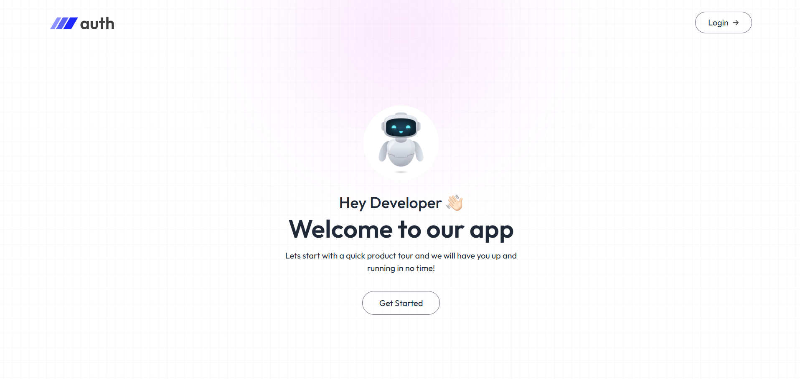
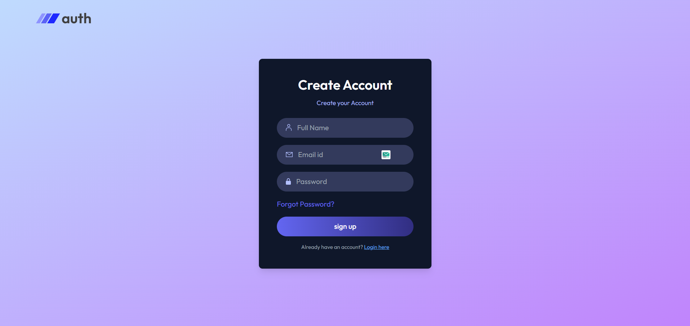
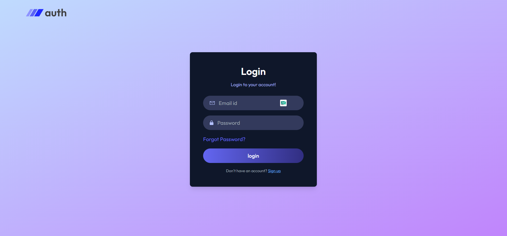
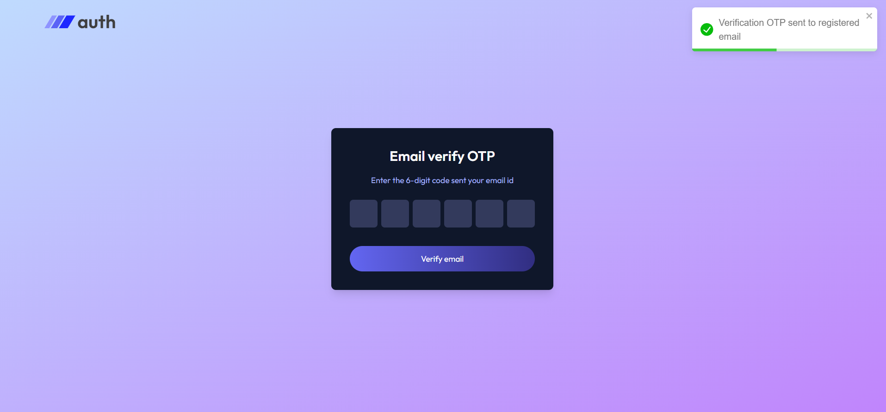
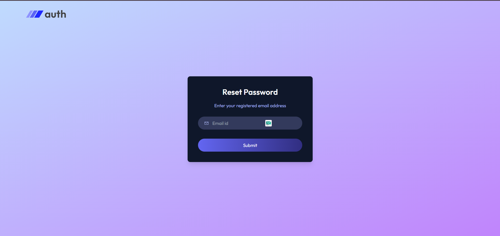

MERN Authentification Project  

This project is a simple authentication system built using the MERN stack (MongoDB, Express.js, React, Node.js).  

Here is the preview of project...

 <video src=https://github.com/user-attachments/assets/a7e98590-1a80-4662-acd0-c77f78a1688c autoplay loop muted playsinline>
</video>

https://github.com/user-attachments/assets/a7e98590-1a80-4662-acd0-c77f78a1688c

Below are some of the key pages and features of the application:  

 Home Page  
The landing page of the application where users can navigate and explore authentication options.  
  

---

Register Page  
A simple and user-friendly registration form that allows new users to create an account.  
  

---

Login Page  
A secure login form where registered users can access their accounts using their email and password.  
  

---

Email Verification  
Once a user registers, an email verification step ensures that the provided email is valid before granting full access.  
  

---
Reset Password  
If a user forgets their password, they can easily reset it through this page by verifying their email.  
  
